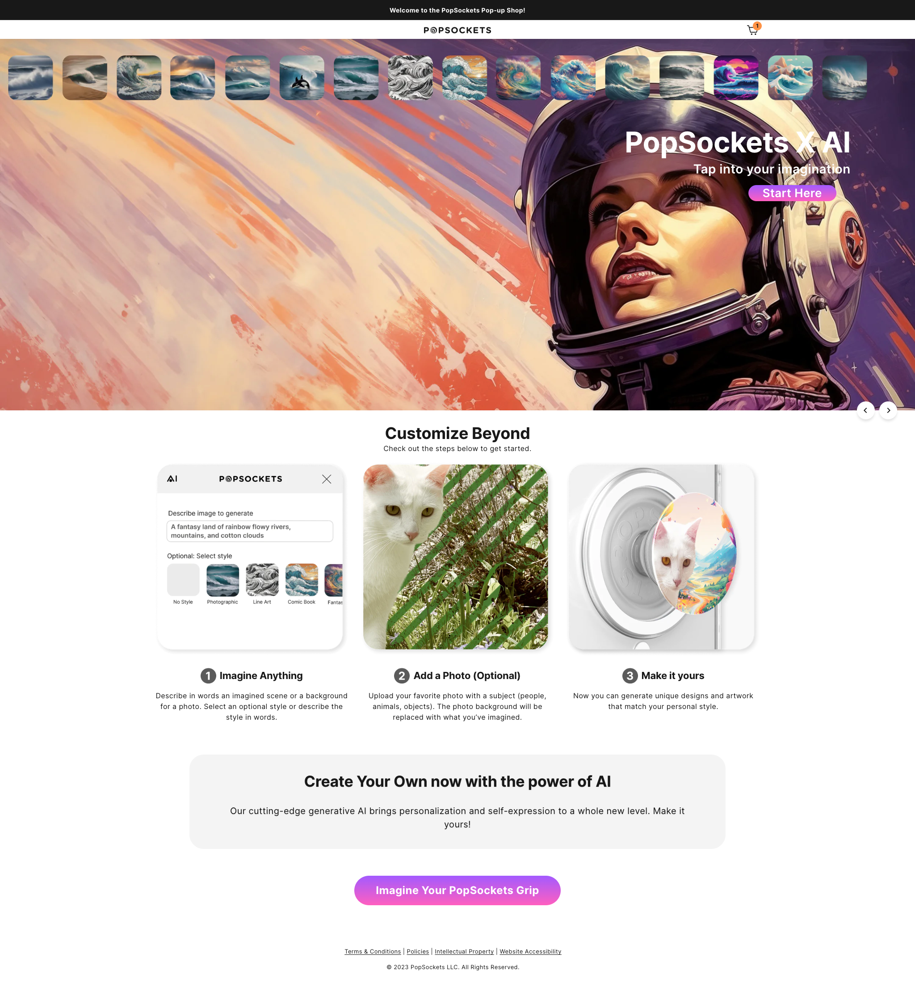

# webpage-design-example-1page-promo-event
Here are some screenshots of a beautifully designed webpage I created for a product-release event at PopSockets. This was originally created on Shopify using custom liquid code. Some of the sections were custom built, other sections had heavy modifications from the original/default styling and design they come with out the box. 

## The website was built with several breakpoints because it was a single page/landing page intended for our event. This event utilized Tablets, Desktops, and Mobile phones. We intentionally created specific breakpoints and positioning for each size. The following images show the design at different screen widths. 

## File 1: 
This is a chunk of code with some breif CSS styling to easily make it so you can display any text, ideally a header -- so that it looks like it is reflected.

### Screenshot of Reflected Text 

AI Customizer Evenet/FireShot Capture 007 - PopSockets PopUp Store – PopSockets Popup - Boulder - popshop.popsockets.com.png

